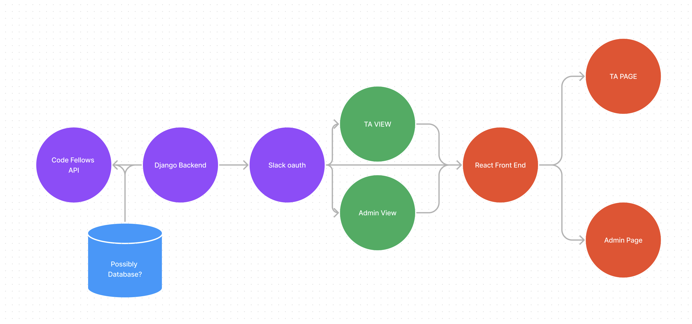
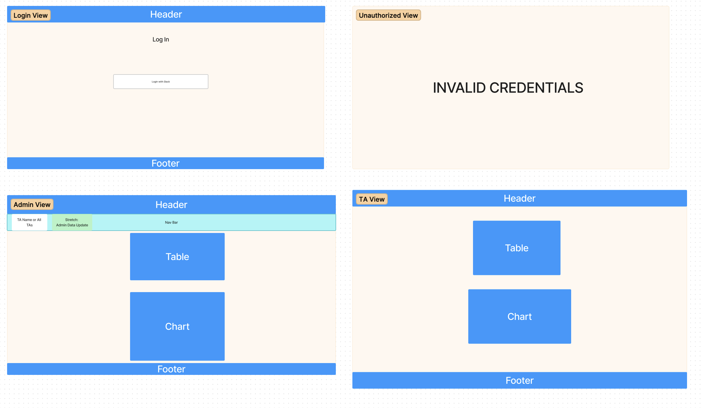

# Software Requirements

---

## Vision

### What is the vision of this product?

Create an app that organizes Code Fellow's TA data and provides insights about ticket volumes and wait times. Renders a table of individual TA statistics and a chart of aggregate statistics. 

### What pain point does this project solve?

Currently, all data is handled in Excel spreadsheets, so data processing is slow and time-consuming to maintain, and patterns in the data are hard to see.

### Why should we care about your product?

This will help the Code Fellows community to better allocate time and resources.

## Scope (In/Out)

>IN

* Provide data visualization for TA ticket queue data
* Provide admin access to all TA data
* Provide TA individual and aggregate data

>OUT

* It will not handle TA ticket resolutions
* It will not make edits to Code Fellows API data

## Minimum Viable Product

### What will your MVP functionality be?

* **Front End:**
  * Weekly Statistics 
  * Admin View
  * TA View 

* **Back End:**
  * OAuth with Slack
  * Refreshing statistics daily 
  * API call to Client Database 

### What are your stretch goals?

* Creating our own Database
* Manual Ability to edit the JSON record data or delete it for Admin use 
* Charts for added visual appeal 

## Functional Requirements

* TA can see their individual statistics
* TA can see aggregate statistics
* Admin can see statistics from any TA
* Admin can see aggregate statistics

## Data Flow
* Domain Model

* Wireframe 

## Non-functional requirements

* **Usability** 
  * Our application should be intuitive and present clear and readable data and visualizations.
  * Try to adhere to easily modifiable, extensible, and dry code.

* **Testability** 
  * We use Django testing suite for testing our application.
  * We use Read testing library for front end.
  * We follow principles of test driven development.
  * In order to ensure proper functionality, test coverage is 80%.